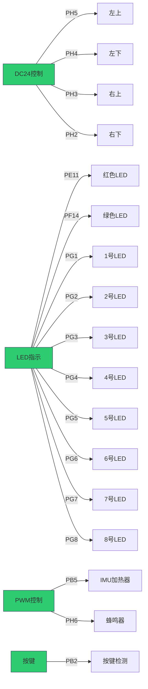
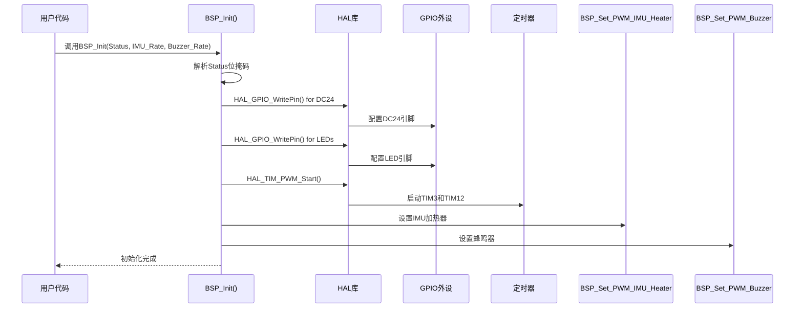
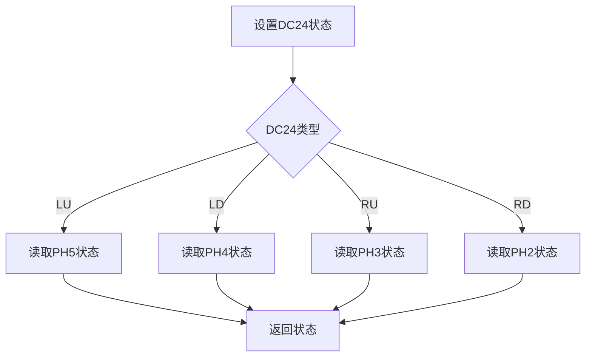

# STM32 A板板级支持包深度解析

## 一、程序概述

这是一个基于STM32F4系列的板级支持包(BSP)，用于控制A板硬件资源，包括DC24电源控制、LED指示灯、MPU6500传感器和蜂鸣器等。程序采用HAL库实现，提供简洁的硬件抽象接口。

------

## 二、文件结构与作用域

### 1. 头文件 `drv_djiboarda.h`

**作用域**：全局（所有包含该头文件的文件可访问）

```markdown
+---------------------+
|    drv_djiboarda.h  |
|  (头文件)           |
+---------------------+
|  - 全局类型定义     |
|  - 全局变量声明     |
|  - 函数接口声明     |
+---------------------+
```

### 2. 实现文件 `drv_djiboarda.cpp`

**作用域**：仅本文件（实现细节对外隐藏）

```markdown
+---------------------+
|    drv_djiboarda.cpp|
|  (实现文件)         |
+---------------------+
|  - 全局变量定义     |
|  - 函数实现         |
+---------------------+
```

------

## 三、核心组件解析

### 1. 数据结构：枚举类型

#### 1.1 DC24状态枚举

```c
enum Enum_BSP_DC24_Status{
    BSP_DC24_Status_DISABLED = 0,
    BSP_DC24_Status_ENABLED,
};
```

**作用**：表示DC24（24V直流电源）的开启/关闭状态

- `BSP_DC24_Status_DISABLED`：关闭状态
- `BSP_DC24_Status_ENABLED`：开启状态

#### 1.2 LED状态枚举

```c
enum Enum_BSP_LED_Status{
    BSP_LED_Status_ENABLED = 0,
    BSP_LED_Status_DISABLED,
};
```

**作用**：表示LED的开启/关闭状态

- `BSP_LED_Status_ENABLED`：LED开启
- `BSP_LED_Status_DISABLED`：LED关闭

#### 1.3 按键状态枚举

```c
enum Enum_BSP_Key_Status{
    BSP_Key_Status_FREE = 0,
    BSP_Key_Status_TRIG_FREE_PRESSED,
    BSP_Key_Status_TRIG_PRESSED_FREE,
    BSP_Key_Status_PRESSED,
};
```

**作用**：表示按键的四种状态

- `BSP_Key_Status_FREE`：按键未被按下
- `BSP_Key_Status_TRIG_FREE_PRESSED`：按键从释放到按下的触发
- `BSP_Key_Status_TRIG_PRESSED_FREE`：按键从按下到释放的触发
- `BSP_Key_Status_PRESSED`：按键被持续按下

------

## 四、关键宏定义

### 1. DC24状态宏

```c
#define BSP_DC24_LU_ON (1 << 0)  // 左上DC24开启
#define BSP_DC24_LD_ON (1 << 1)  // 左下DC24开启
#define BSP_DC24_RU_ON (1 << 2)  // 右上DC24开启
#define BSP_DC24_RD_ON (1 << 3)  // 右下DC24开启
```

**作用**：用于按位或组合DC24状态 **示例**：`BSP_DC24_LU_ON | BSP_DC24_RD_ON` 表示同时开启左上和右下DC24

### 2. LED状态宏

```c
#define BSP_LED_R_ON (1 << 4)  // 红色LED开启
#define BSP_LED_G_ON (1 << 5)  // 绿色LED开启
#define BSP_LED_1_ON (1 << 6)  // 1号LED开启
// ... 其他LED宏
```

**作用**：用于按位或组合LED状态

------

## 五、硬件资源映射

### 1. 外设资源分配表

| 资源类型  | 位置 | 引脚 | 外设  | 用途            |
| --------- | ---- | ---- | ----- | --------------- |
| DC24控制  | 左上 | PH5  | GPIO  | 24V电源控制     |
| DC24控制  | 左下 | PH4  | GPIO  | 24V电源控制     |
| DC24控制  | 右上 | PH3  | GPIO  | 24V电源控制     |
| DC24控制  | 右下 | PH2  | GPIO  | 24V电源控制     |
| LED       | 红色 | PE11 | GPIO  | 状态指示        |
| LED       | 绿色 | PF14 | GPIO  | 状态指示        |
| LED       | 1号  | PG1  | GPIO  | 状态指示        |
| LED       | 2号  | PG2  | GPIO  | 状态指示        |
| ...       | ...  | ...  | ...   | ...             |
| LED       | 8号  | PG8  | GPIO  | 状态指示        |
| IMU加热器 | PWM  | PB5  | TIM3  | MPU6500加热控制 |
| 蜂鸣器    | PWM  | PH6  | TIM12 | 蜂鸣器控制      |
| 按键      | 按键 | PB2  | GPIO  | 状态检测        |

### 2. 资源分配图



------

## 六、关键函数解析

### 1. BSP_Init() 函数

**文件**：`drv_djiboarda.cpp`
**功能**：初始化A板所有硬件资源

```c
void BSP_Init(uint32_t Status, float IMU_Heater_Rate, float Buzzer_Rate)
{
    BSP_Set_DC24_LU(static_cast<Enum_BSP_DC24_Status>((Status & BSP_DC24_LU_ON) == 0 ? BSP_DC24_Status_DISABLED : BSP_DC24_Status_ENABLED));
    // ... 其他DC24初始化
    
    BSP_Set_LED_R(static_cast<Enum_BSP_LED_Status>((Status & BSP_LED_R_ON) == 0 ? BSP_LED_Status_DISABLED : BSP_LED_Status_ENABLED));
    // ... 其他LED初始化
    
    HAL_TIM_PWM_Start(&htim3, TIM_CHANNEL_2);
    HAL_TIM_PWM_Start(&htim12, TIM_CHANNEL_1);
    
    BSP_Set_PWM_IMU_Heater(IMU_Heater_Rate);
    BSP_Set_PWM_Buzzer(Buzzer_Rate);
}
```

**参数说明**：

| 参数              | 类型       | 说明                            |
| ----------------- | ---------- | ------------------------------- |
| `Status`          | `uint32_t` | 位掩码，指定DC24和LED的初始状态 |
| `IMU_Heater_Rate` | `float`    | IMU加热器的PWM占空比（0.0-1.0） |
| `Buzzer_Rate`     | `float`    | 蜂鸣器的PWM占空比（0.0-1.0）    |

**执行流程**：

1. 根据`Status`设置DC24和LED的初始状态
2. 启动两个PWM定时器（TIM3和TIM12）
3. 设置IMU加热器和蜂鸣器的PWM占空比

------

### 2. 状态获取函数

**示例：BSP_Get_DC24_LU()**

```c
Enum_BSP_DC24_Status BSP_Get_DC24_LU()
{
    return (static_cast<Enum_BSP_DC24_Status>(HAL_GPIO_ReadPin(GPIOH, GPIO_PIN_5)));
}
```

**作用**：读取左上DC24的状态

- 返回`BSP_DC24_Status_ENABLED`表示开启
- 返回`BSP_DC24_Status_DISABLED`表示关闭

**执行流程**：

1. 通过HAL库读取GPIOH的PIN5状态
2. 将GPIO状态转换为枚举值

------

### 3. 状态设置函数

**示例：BSP_Set_DC24_LU()**

```c
void BSP_Set_DC24_LU(Enum_BSP_DC24_Status Status)
{
    HAL_GPIO_WritePin(GPIOH, GPIO_PIN_5, static_cast<GPIO_PinState>(Status));
}
```

**作用**：设置左上DC24的状态

- `BSP_DC24_Status_ENABLED` → 开启DC24
- `BSP_DC24_Status_DISABLED` → 关闭DC24

**执行流程**：

1. 将枚举值转换为GPIO状态
2. 通过HAL库写入GPIOH的PIN5

------

### 4. PWM设置函数

**示例：BSP_Set_PWM_IMU_Heater()**

```c
void BSP_Set_PWM_IMU_Heater(float Rate)
{
    __HAL_TIM_SetCompare(&htim3, TIM_CHANNEL_2, Rate * 65535);
}
```

**作用**：设置IMU加热器的PWM占空比

- `Rate`范围：0.0（0%占空比）到1.0（100%占空比）
- `65535`是TIM3的ARR值（16位定时器最大值）

**执行流程**：

1. 计算PWM值 = Rate × 65535
2. 设置TIM3的通道2比较值

------

## 七、工作流程图解

### 1. BSP初始化流程



### 2. DC24状态控制流程



------

## 八、关键设计要点

### 1. 为什么使用位掩码？

- **紧凑性**：用32位整数表示8个DC24和8个LED状态
- **效率**：单次操作即可设置多个状态
- **灵活性**：任意组合状态（如只开启左上和右下DC24）

### 2. 为什么使用枚举类型？

- **类型安全**：避免使用整数常量导致的错误
- **可读性**：`BSP_DC24_Status_ENABLED` 比 `1` 更清晰
- **维护性**：修改状态值只需修改枚举定义

### 3. 为什么使用HAL库？

- **硬件抽象**：屏蔽底层寄存器操作
- **可移植性**：更容易迁移到其他STM32系列
- **开发效率**：减少底层代码编写

------

## 九、使用示例

### 1. 初始化A板

```c
// 初始化A板，开启左上DC24、红色LED和绿色LED
uint32_t initStatus = BSP_DC24_LU_ON | BSP_LED_R_ON | BSP_LED_G_ON;
BSP_Init(initStatus, 0.5f, 0.3f); // IMU加热器50%，蜂鸣器30%
```

### 2. 控制DC24

```c
// 开启右下DC24
BSP_Set_DC24_RD(BSP_DC24_Status_ENABLED);

// 关闭左下DC24
BSP_Set_DC24_LD(BSP_DC24_Status_DISABLED);
```

### 3. 控制LED

```c
// 开启1号LED
BSP_Set_LED_1(BSP_LED_Status_ENABLED);

// 关闭所有LED
BSP_Set_LED_1(BSP_LED_Status_DISABLED);
BSP_Set_LED_2(BSP_LED_Status_DISABLED);
// ... 依次关闭所有LED
```

### 4. 控制PWM

```c
// 设置IMU加热器为75%占空比
BSP_Set_PWM_IMU_Heater(0.75f);

// 设置蜂鸣器为50%占空比
BSP_Set_PWM_Buzzer(0.5f);
```

------

## 十、设计优势总结

| 优势         | 说明                      |
| ------------ | ------------------------- |
| **硬件抽象** | 通过BSP隐藏底层硬件细节   |
| **状态管理** | 位掩码实现高效状态组合    |
| **接口简洁** | 简单的函数接口，易于使用  |
| **资源高效** | 合理利用GPIO和定时器资源  |
| **可扩展性** | 添加新功能只需扩展BSP接口 |

------

## 十一、常见问题解答

**Q：为什么DC24和LED使用不同的宏？**
A：DC24控制需要4个独立状态，LED需要8个独立状态，使用不同的宏空间避免冲突。

**Q：为什么IMU加热器的PWM计算使用65535？**
A：TIM3是16位定时器，ARR寄存器最大值为65535，所以占空比计算为`Rate * 65535`。

**Q：如何获取按键状态？**
A：调用`BSP_Get_Key()`函数，返回按键状态枚举值。

**Q：为什么使用`static_cast`转换类型？**
A：确保枚举值与HAL库的GPIO状态值兼容，避免类型不匹配错误。

------

> **提示**：此BSP是机器人控制系统的基础组件，用于控制A板的硬件资源。实际使用中需在STM32CubeMX中正确配置GPIO和定时器，然后调用BSP接口函数即可。