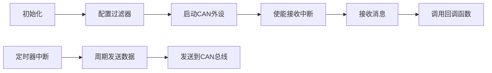

# CAN通信驱动程序深度解析

以下是对`drv_can.h`和`drv_can.cpp`文件的深度解析，以Markdown格式呈现。我将逐步解释每段代码，说明函数作用、类（结构体）的作用域和使用的外设资源。

------

## 一、文件概述

- **文件类型**：STM32 CAN通信驱动程序（基于HAL库）
- **目标平台**：STM32F4系列微控制器
- **核心功能**：提供CAN总线通信的初始化、数据收发、中断处理
- **版本**：2.2（2024-08-22更新）

------

## 二、头文件 `drv_can.h` 解析

### 1. 头文件保护

```c
#ifndef DRV_CAN_H
#define DRV_CAN_H
```

- **作用**：防止头文件重复包含
- **作用域**：全局

### 2. 包含的头文件

```c
#include "stm32f4xx_hal.h"  // STM32 HAL库核心头文件
#include "can.h"            // CAN外设HAL库头文件
#include <string.h>         // C标准库字符串操作
```

- **外设资源**：STM32F4的CAN外设
- **作用**：提供HAL库函数和CAN相关数据结构

------

### 3. 关键数据结构

#### (1) `Struct_CAN_Rx_Buffer` - CAN接收缓冲区

```c
struct Struct_CAN_Rx_Buffer {
    CAN_RxHeaderTypeDef Header;  // 接收消息头
    uint8_t Data[8];             // 8字节数据缓冲区
};
```

- **作用域**：全局（在头文件中声明）
- **作用**：存储接收到的CAN消息
  - `Header`：包含ID、长度、帧类型等信息（来自HAL库）
  - `Data`：实际数据缓冲区（最大8字节）
- **外设关联**：CAN接收FIFO

#### (2) `CAN_Call_Back` - 回调函数类型

```c
typedef void (*CAN_Call_Back)(Struct_CAN_Rx_Buffer *);
```

- **作用域**：全局
- **作用**：定义接收消息的回调函数类型
  - 用于在收到CAN消息后触发自定义处理逻辑
  - 参数：指向`Struct_CAN_Rx_Buffer`的指针

#### (3) `Struct_CAN_Manage_Object` - CAN管理对象

```c
struct Struct_CAN_Manage_Object {
    CAN_HandleTypeDef *CAN_Handler;  // CAN外设句柄
    Struct_CAN_Rx_Buffer Rx_Buffer;  // 接收缓冲区
    CAN_Call_Back Callback_Function; // 回调函数
};
```

- **作用域**：全局
- **作用**：封装CAN通信的管理状态
  - `CAN_Handler`：指向CAN外设的指针
  - `Rx_Buffer`：接收数据缓冲区
  - `Callback_Function`：消息到达时的回调函数
- **外设关联**：CAN1和CAN2的管理对象

------

### 4. 全局变量声明

```c
extern bool init_finished;  // 初始化完成标志
extern CAN_HandleTypeDef hcan1;  // CAN1句柄
extern CAN_HandleTypeDef hcan2;  // CAN2句柄
extern Struct_CAN_Manage_Object CAN1_Manage_Object;  // CAN1管理对象
extern Struct_CAN_Manage_Object CAN2_Manage_Object;  // CAN2管理对象
```

#### 关键发送缓冲区（8字节/个）

```c
// CAN1 (电机共享区)
extern uint8_t CAN1_0x1fe_Tx_Data[];  // ID 0x1fe
extern uint8_t CAN1_0x1ff_Tx_Data[];  // ID 0x1ff
extern uint8_t CAN1_0x200_Tx_Data[];  // ID 0x200
// ... (其他ID)

// CAN2 (电机共享区)
extern uint8_t CAN2_0x1fe_Tx_Data[];  // ID 0x1fe
// ... (其他ID)

// 超级电容专属
extern uint8_t CAN_Supercap_Tx_Data[]; // 超级电容专用
```

- **作用**：存储待发送的CAN数据
- **ID含义**：0x1fe、0x200等是CAN消息的ID，用于区分不同设备/功能
- **外设关联**：CAN发送缓冲区

------

### 5. 函数声明

#### (1) `CAN_Init()`

```c
void CAN_Init(CAN_HandleTypeDef *hcan, CAN_Call_Back Callback_Function);
```

- **作用**：初始化CAN外设
- **参数**：
  - `hcan`：CAN外设句柄（CAN1或CAN2）
  - `Callback_Function`：接收消息后的回调函数
- **外设关联**：CAN1/CAN2外设初始化

#### (2) `CAN_Send_Data()`

```c
uint8_t CAN_Send_Data(CAN_HandleTypeDef *hcan, uint16_t ID, uint8_t *Data, uint16_t Length);
```

- **作用**：发送CAN数据帧
- **参数**：
  - `hcan`：CAN外设句柄
  - `ID`：目标CAN ID
  - `Data`：数据指针
  - `Length`：数据长度（0-8字节）
- **返回值**：发送状态（HAL库返回值）
- **外设关联**：CAN发送

#### (3) `TIM_1ms_CAN_PeriodElapsedCallback()`

```c
void TIM_1ms_CAN_PeriodElapsedCallback();
```

- **作用**：定时器1ms中断回调函数
- **用途**：周期性发送CAN数据（用于电机控制）
- **外设关联**：TIM定时器（1ms周期）

------

## 三、源文件 `drv_can.cpp` 解析

### 1. 私有宏定义

```c
// 滤波器编号
#define CAN_FILTER(x) ((x) << 3)    // 滤波器Bank = x << 3

// 接收队列
#define CAN_FIFO_0 (0 << 2)         // FIFO0
#define CAN_FIFO_1 (1 << 2)         // FIFO1

// 标准帧/扩展帧
#define CAN_STDID (0 << 1)          // 标准ID帧
#define CAN_EXTID (1 << 1)          // 扩展ID帧

// 数据帧/遥控帧
#define CAN_DATA_TYPE (0 << 0)      // 数据帧
#define CAN_REMOTE_TYPE (1 << 0)    // 遥控帧
```

- **作用**：简化CAN过滤器配置
- **外设关联**：CAN过滤器配置

------

### 2. 全局变量初始化

```c
Struct_CAN_Manage_Object CAN1_Manage_Object = {0};
Struct_CAN_Manage_Object CAN2_Manage_Object = {0};
```

- **作用**：初始化CAN1/CAN2的管理对象
- **作用域**：文件作用域（仅在本文件可见）

```c
// 发送缓冲区初始化（8字节）
uint8_t CAN1_0x1fe_Tx_Data[8];
// ... (其他缓冲区)
```

- **作用**：为发送数据分配缓冲区
- **外设关联**：CAN发送缓冲区

------

### 3. 核心函数实现

#### (1) `can_filter_mask_config()` - 配置CAN过滤器

```c
void can_filter_mask_config(CAN_HandleTypeDef *hcan, uint8_t Object_Para, uint32_t ID, uint32_t Mask_ID) {
    CAN_FilterTypeDef can_filter_init_structure;
    // ... (配置过滤器参数)
    HAL_CAN_ConfigFilter(hcan, &can_filter_init_structure);
}
```

- **作用**：配置CAN接收过滤器

- **关键参数**：

  - `Object_Para`：组合参数（滤波器编号+FIFO+ID类型）
  - `ID`：目标ID
  - `Mask_ID`：ID掩码（0x3FF或0x1FFFFFFF）

- **外设关联**：CAN过滤器（共28个，CAN1前14个，CAN2后14个）

- **使用示例**：

  ```c
  can_filter_mask_config(hcan1, 
                         CAN_FILTER(0) | CAN_FIFO_0 | CAN_STDID | CAN_DATA_TYPE, 
                         0, 0);
  // 允许接收所有标准ID帧
  ```

#### (2) `CAN_Init()` - 初始化CAN

```c
void CAN_Init(CAN_HandleTypeDef *hcan, CAN_Call_Back Callback_Function) {
    HAL_CAN_Start(hcan);  // 启动CAN外设
    __HAL_CAN_ENABLE_IT(hcan, CAN_IT_RX_FIFO0_MSG_PENDING);  // 使能FIFO0中断
    __HAL_CAN_ENABLE_IT(hcan, CAN_IT_RX_FIFO1_MSG_PENDING);  // 使能FIFO1中断
    
    if (hcan->Instance == CAN1) {
        CAN1_Manage_Object.CAN_Handler = hcan;
        CAN1_Manage_Object.Callback_Function = Callback_Function;
        // 配置过滤器（接收所有ID）
        can_filter_mask_config(hcan, CAN_FILTER(0) | CAN_FIFO_0 | CAN_STDID | CAN_DATA_TYPE, 0, 0);
        can_filter_mask_config(hcan, CAN_FILTER(1) | CAN_FIFO_1 | CAN_STDID | CAN_DATA_TYPE, 0, 0);
    }
    // ... (CAN2处理)
}
```

- **作用**：初始化CAN外设和中断
- **关键步骤**：
  1. 启动CAN外设
  2. 使能接收中断（FIFO0和FIFO1）
  3. 初始化管理对象
  4. 配置过滤器（允许接收所有ID）
- **外设关联**：CAN1/CAN2外设、中断控制器

#### (3) `CAN_Send_Data()` - 发送CAN数据

```c
uint8_t CAN_Send_Data(CAN_HandleTypeDef *hcan, uint16_t ID, uint8_t *Data, uint16_t Length) {
    CAN_TxHeaderTypeDef tx_header;
    tx_header.StdId = ID;        // 标准ID
    tx_header.ExtId = 0;        // 扩展ID
    tx_header.IDE = 0;          // 标准帧
    tx_header.RTR = 0;          // 数据帧
    tx_header.DLC = Length;     // 数据长度
    
    uint32_t used_mailbox;
    return HAL_CAN_AddTxMessage(hcan, &tx_header, Data, &used_mailbox);
}
```

- **作用**：发送CAN数据帧
- **关键参数**：
  - `ID`：目标CAN ID（如0x1fe）
  - `Data`：待发送数据指针
  - `Length`：数据长度（0-8字节）
- **外设关联**：CAN发送邮箱

#### (4) `TIM_1ms_CAN_PeriodElapsedCallback()` - 周期发送

```c
void TIM_1ms_CAN_PeriodElapsedCallback() {
    static int mod2 = 0;
    mod2++;
    if (mod2 == 2) {
        mod2 = 0;
        // CAN2半频电机（每2ms发送一次）
        CAN_Send_Data(&hcan2, 0x1fe, CAN2_0x1fe_Tx_Data, 8);  // 舵向电机
        CAN_Send_Data(&hcan2, 0x200, CAN2_0x200_Tx_Data, 8);  // 轮向电机
    }
    // CAN1全频电机（每1ms发送一次）
    CAN_Send_Data(&hcan1, 0x200, CAN1_0x200_Tx_Data, 8);  // 摩擦轮电机
    CAN_Send_Data(&hcan1, 0x1fe, CAN1_0x1fe_Tx_Data, 8);  // 云台电机
}
```

- **作用**：定时器中断回调，周期性发送CAN数据
- **发送策略**：
  - CAN2设备：每2ms发送一次（0x1fe, 0x200）
  - CAN1设备：每1ms发送一次（0x1fe, 0x200）
- **外设关联**：TIM定时器（1ms周期）、CAN1/CAN2

#### (5) `HAL_CAN_RxFifo0MsgPendingCallback()` - FIFO0中断处理

```c
void HAL_CAN_RxFifo0MsgPendingCallback(CAN_HandleTypeDef *hcan) {
    if (init_finished == false) return;  // 初始化未完成
    
    if (hcan->Instance == CAN1) {
        HAL_CAN_GetRxMessage(hcan, CAN_FILTER_FIFO0, 
                             &CAN1_Manage_Object.Rx_Buffer.Header, 
                             CAN1_Manage_Object.Rx_Buffer.Data);
        if(CAN1_Manage_Object.Callback_Function != nullptr) {
            CAN1_Manage_Object.Callback_Function(&CAN1_Manage_Object.Rx_Buffer);
        }
    }
    // ... (CAN2处理)
}
```

- **作用**：处理FIFO0接收到的消息
- **关键流程**：
  1. 检查初始化状态
  2. 获取接收消息
  3. 调用回调函数处理
- **外设关联**：CAN接收FIFO0、中断控制器

#### (6) `HAL_CAN_RxFifo1MsgPendingCallback()` - FIFO1中断处理

- **作用**：与FIFO0处理类似，处理FIFO1接收的消息
- **区别**：处理FIFO1接收的缓冲区
- **外设关联**：CAN接收FIFO1

------

## 四、系统架构总结

### 1. 通信架构

```
CAN1 (高速)       CAN2 (低速)
|----------------|----------------|
| 摩擦轮电机     | 舵轮底盘       |
| 云台电机       | 舵向/轮向电机  |
|----------------|----------------|
| 0x1fe, 0x200   | 0x1fe, 0x200   |
```

### 2. 关键外设资源

| 资源       | 数量 | 用途     | 说明                   |
| ---------- | ---- | -------- | ---------------------- |
| CAN外设    | 2    | 通信通道 | CAN1(高速), CAN2(低速) |
| FIFO       | 2    | 接收缓冲 | FIFO0/FIFO1            |
| 过滤器     | 28   | 消息过滤 | CAN1前14个, CAN2后14个 |
| 发送缓冲区 | 15   | 数据存储 | 每个ID 8字节           |

### 3. 通信流程



### 4. 关键ID说明

| ID    | 用途            | 通信速率 |
| ----- | --------------- | -------- |
| 0x1fe | 云台/舵向电机   | 1ms      |
| 0x200 | 摩擦轮/轮向电机 | 1ms      |
| 0x1ff | 电机状态反馈    | 1ms      |
| 0x2ff | 电机状态反馈    | 1ms      |
| 0x3fe | 超级电容        | 10ms     |

------

## 五、使用示例

### 1. 初始化CAN

```c
// 初始化CAN1
CAN_Init(&hcan1, my_can_callback);

// 初始化CAN2
CAN_Init(&hcan2, my_can_callback);
```

### 2. 发送数据

```c
// 设置电机控制数据
CAN1_0x200_Tx_Data[0] = 0x01;  // 电机ID
CAN1_0x200_Tx_Data[1] = 0x80;  // 速度值

// 发送数据
CAN_Send_Data(&hcan1, 0x200, CAN1_0x200_Tx_Data, 8);
```

### 3. 处理接收数据

```c
void my_can_callback(Struct_CAN_Rx_Buffer *rx_buf) {
    if (rx_buf->Header.StdId == 0x1fe) {
        // 处理云台电机反馈
        uint8_t speed = rx_buf->Data[0];
    }
}
```

------

## 六、关键设计特点

1. **双CAN总线设计**：
   - CAN1：高速通信（摩擦轮/云台）
   - CAN2：低速通信（底盘/舵轮）
2. **灵活的过滤机制**：
   - 通过`can_filter_mask_config`配置任意ID过滤
   - 允许接收所有ID（ID=0, Mask_ID=0）
3. **中断驱动通信**：
   - 接收中断触发回调处理
   - 避免轮询，提高系统效率
4. **周期性发送**：
   - 通过定时器中断实现周期发送
   - 优化电机控制频率
5. **内存管理**：
   - 为每个ID分配独立缓冲区
   - 避免数据覆盖

------

## 七、注意事项

1. **初始化顺序**：
   - 必须在`HAL_CAN_Init()`之后调用`CAN_Init()`
   - 确保`init_finished`标志在初始化后置位
2. **回调函数安全**：
   - 代码中添加了`nullptr`检查
   - 避免空指针调用
3. **ID冲突**：
   - 需要确保不同设备使用不同ID
   - 避免CAN总线冲突
4. **数据长度**：
   - CAN帧最大8字节
   - 发送时需确保`Length`≤8

> 本驱动程序专为机器人控制系统设计，已适配DJI电机、达妙电机和超级电容，是STM32F4平台CAN通信的典型实现方案。