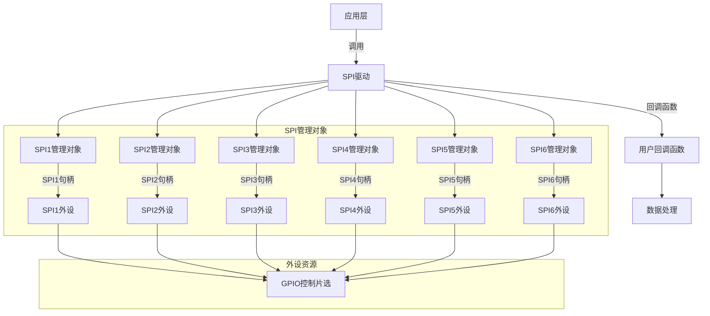
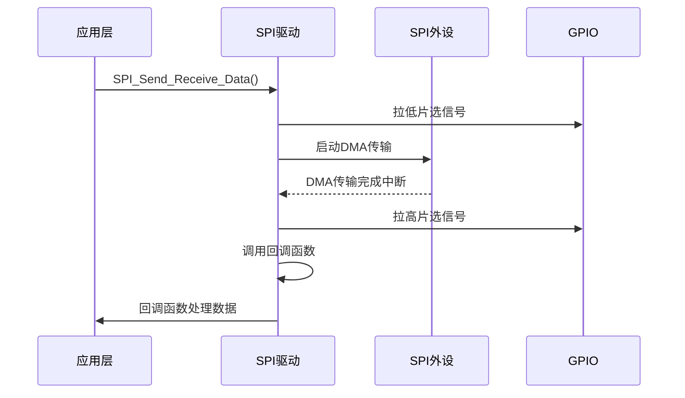

# SPI驱动程序深度解析

## 整体概述

这个SPI驱动程序是为STM32F4系列微控制器设计的，用于管理SPI1到SPI6外设的通信。它采用面向对象的设计思想，通过结构体管理每个SPI外设的状态，并利用DMA进行高效数据传输。程序支持通过回调函数处理接收数据，实现通信与业务逻辑的解耦。

## 文件结构分析

### 1. `drv_spi.h` 文件

#### 头文件保护

```c
#ifndef DRV_SPI_H
#define DRV_SPI_H
```

- 用于防止头文件被重复包含
- 确保编译时只包含一次该头文件

#### 外部依赖

```c
#include "stm32f4xx_hal.h"
#include "spi.h"
#include <string.h>
```

- `stm32f4xx_hal.h`: STM32F4 HAL库核心头文件，提供硬件抽象层接口
- `spi.h`: SPI外设的HAL库头文件
- `string.h`: 提供字符串操作函数，用于缓冲区管理

#### 缓冲区定义

```c
#define SPI_BUFFER_SIZE 256
```

- 定义SPI通信的缓冲区大小为256字节
- 用于存储发送和接收数据

#### 回调函数类型

```c
typedef void (*SPI_Call_Back)(uint8_t *Tx_Buffer, uint8_t *Rx_Buffer, uint16_t Length);
```

- 定义SPI通信完成后的回调函数类型
- 参数说明：
  - `Tx_Buffer`: 发送数据缓冲区
  - `Rx_Buffer`: 接收数据缓冲区
  - `Length`: 传输的数据长度

#### SPI管理结构体

```c
struct Struct_SPI_Manage_Object {
    SPI_HandleTypeDef *SPI_Handler;
    GPIO_TypeDef *Now_GPIOx;
    uint16_t Now_GPIO_Pin;
    uint8_t Tx_Buffer[SPI_BUFFER_SIZE];
    uint8_t Rx_Buffer[SPI_BUFFER_SIZE];
    uint16_t Now_Tx_Length;
    uint16_t Now_Rx_Length;
    SPI_Call_Back Callback_Function;
};
```

- **作用**：管理单个SPI外设的通信状态
- **成员说明**：
  - `SPI_Handler`: SPI外设句柄指针
  - `Now_GPIOx`: 当前片选GPIO端口
  - `Now_GPIO_Pin`: 当前片选GPIO引脚
  - `Tx_Buffer/Rx_Buffer`: 发送/接收数据缓冲区
  - `Now_Tx_Length/Now_Rx_Length`: 当前传输的数据长度
  - `Callback_Function`: 通信完成后的回调函数

#### 外部变量声明

```c
extern bool init_finished;
extern Struct_SPI_Manage_Object SPI1_Manage_Object;
extern Struct_SPI_Manage_Object SPI2_Manage_Object;
extern Struct_SPI_Manage_Object SPI3_Manage_Object;
extern Struct_SPI_Manage_Object SPI4_Manage_Object;
extern Struct_SPI_Manage_Object SPI5_Manage_Object;
extern Struct_SPI_Manage_Object SPI6_Manage_Object;
extern uint8_t SPI5_PF6_Tx_Data[];
```

- **作用域**：全局作用域
- **说明**：
  - `init_finished`: 初始化完成标志
  - `SPIx_Manage_Object`: 6个SPI外设的管理对象
  - `SPI5_PF6_Tx_Data`: SPI5的PF6引脚传输数据

#### 函数声明

```c
void SPI_Init(SPI_HandleTypeDef *hspi, SPI_Call_Back Callback_Function);
uint8_t SPI_Send_Receive_Data(SPI_HandleTypeDef *hspi, GPIO_TypeDef *GPIOx, uint16_t GPIO_Pin, uint16_t Tx_Length, uint16_t Rx_Length);
void TIM_100us_SPI_PeriodElapsedCallback();
```

- **作用**：声明驱动程序的接口函数

## 2. `drv_spi.cpp` 文件

#### 全局变量初始化

```c
Struct_SPI_Manage_Object SPI1_Manage_Object = {0};
Struct_SPI_Manage_Object SPI2_Manage_Object = {0};
// ... 其他SPI管理对象
```

- **作用**：初始化所有SPI管理对象
- **说明**：所有成员被初始化为0，确保初始状态安全

#### SPI初始化函数

```c
void SPI_Init(SPI_HandleTypeDef *hspi, SPI_Call_Back Callback_Function)
{
    if (hspi->Instance == SPI1) {
        SPI1_Manage_Object.SPI_Handler = hspi;
        SPI1_Manage_Object.Callback_Function = Callback_Function;
    }
    // ... 其他SPI外设的处理
}
```

- **作用**：初始化SPI管理对象
- **参数**：
  - `hspi`: SPI外设句柄
  - `Callback_Function`: 通信完成后的回调函数
- **实现**：
  - 根据SPI实例选择对应的管理对象
  - 设置SPI句柄和回调函数
- **外设资源**：SPI1-SPI6外设

#### 数据发送接收函数

```c
uint8_t SPI_Send_Receive_Data(SPI_HandleTypeDef *hspi, GPIO_TypeDef *GPIOx, uint16_t GPIO_Pin, uint16_t Tx_Length, uint16_t Rx_Length)
{
    HAL_GPIO_TogglePin(GPIOx, GPIO_Pin);
    if (hspi->Instance == SPI1) {
        SPI1_Manage_Object.Now_GPIOx = GPIOx;
        SPI1_Manage_Object.Now_GPIO_Pin = GPIO_Pin;
        SPI1_Manage_Object.Now_Tx_Length = Tx_Length;
        SPI1_Manage_Object.Now_Rx_Length = Rx_Length;
        return (HAL_SPI_TransmitReceive_DMA(hspi, SPI1_Manage_Object.Tx_Buffer, SPI1_Manage_Object.Rx_Buffer, Tx_Length + Rx_Length));
    }
    // ... 其他SPI外设的处理
}
```

- **作用**：发送和接收数据
- **参数**：
  - `hspi`: SPI外设句柄
  - `GPIOx`: 片选GPIO端口
  - `GPIO_Pin`: 片选GPIO引脚
  - `Tx_Length`: 发送数据长度
  - `Rx_Length`: 接收数据长度
- **实现**：
  1. 切换片选信号（低电平有效）
  2. 设置当前SPI管理对象的参数
  3. 启动DMA传输（`HAL_SPI_TransmitReceive_DMA`）
- **外设资源**：SPI外设 + GPIO外设（用于片选控制）

#### SPI DMA传输完成回调函数

```c
void HAL_SPI_TxRxCpltCallback(SPI_HandleTypeDef *hspi)
{
    if (init_finished == 0) {
        return;
    }
    if (hspi->Instance == SPI1) {
        HAL_GPIO_TogglePin(SPI1_Manage_Object.Now_GPIOx, SPI1_Manage_Object.Now_GPIO_Pin);
        if(SPI1_Manage_Object.Callback_Function != nullptr) {
            SPI1_Manage_Object.Callback_Function(SPI1_Manage_Object.Tx_Buffer, SPI1_Manage_Object.Rx_Buffer, SPI1_Manage_Object.Now_Tx_Length);
        }
    }
    // ... 其他SPI外设的处理
}
```

- **作用**：HAL库SPI传输完成后的回调
- **实现**：
  1. 检查初始化完成标志
  2. 切换片选信号（高电平有效）
  3. 调用用户提供的回调函数处理数据
- **外设资源**：SPI外设（DMA传输完成中断）

## 架构设计图



## 通信流程图



## 关键设计特点

1. **面向对象设计**：
   - 通过`Struct_SPI_Manage_Object`结构体封装SPI状态
   - 每个SPI外设有独立的管理对象
2. **DMA高效传输**：
   - 使用`HAL_SPI_TransmitReceive_DMA`实现DMA传输
   - 避免CPU轮询，提高通信效率
3. **片选信号管理**：
   - 通过GPIO控制片选信号
   - 在数据传输前后切换片选状态
4. **回调机制**：
   - 通过回调函数实现通信与业务逻辑解耦
   - 用户只需实现回调函数处理数据
5. **多SPI外设支持**：
   - 支持SPI1-SPI6，每个外设独立管理
   - 通过实例判断选择对应管理对象

## 外设资源使用总结

| 外设资源  | 用途         | 使用数量 | 说明                            |
| --------- | ------------ | -------- | ------------------------------- |
| SPI1-SPI6 | 通信外设     | 6个      | 每个SPI外设独立管理             |
| GPIO      | 片选信号控制 | 多个     | 每个SPI外设需要一个GPIO作为片选 |
| DMA       | 数据传输     | 6个      | 每个SPI外设使用独立DMA通道      |
| 定时器    | SPI时序控制  | 1个      | 用于100us定时回调（目前为空）   |

## 使用示例

```c
// 回调函数实现
void SPI_Callback(uint8_t *Tx_Buffer, uint8_t *Rx_Buffer, uint16_t Length) {
    // 处理接收到的数据
    // 例如：解析数据、更新状态等
}

// 初始化SPI
SPI_HandleTypeDef hspi1;
SPI_Init(&hspi1, SPI_Callback);

// 发送接收数据
uint8_t tx_data[10] = {0x01, 0x02, 0x03};
uint8_t rx_data[10];
SPI_Send_Receive_Data(&hspi1, GPIOA, GPIO_PIN_4, 10, 10);
```

## 代码设计亮点

1. **结构化设计**：通过结构体集中管理SPI状态，提高代码可读性和可维护性
2. **资源解耦**：SPI通信与业务逻辑分离，用户只需关注数据处理
3. **扩展性**：支持SPI1-SPI6，可轻松扩展到更多SPI外设
4. **高效传输**：使用DMA避免CPU占用，适合实时性要求高的场景
5. **错误处理**：添加了回调函数空指针检查，避免程序崩溃

## 潜在改进建议

1. **添加错误处理**：在SPI传输失败时提供错误处理机制
2. **支持SPI模式配置**：添加SPI模式（主/从模式）配置
3. **添加超时机制**：防止DMA传输长时间挂起
4. **优化内存使用**：考虑动态分配缓冲区，减少固定大小缓冲区的限制

这个SPI驱动程序设计合理，结构清晰，适合在STM32F4平台上进行SPI通信开发，特别适合需要高效数据传输的机器人或嵌入式系统应用。