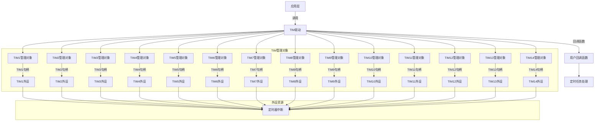
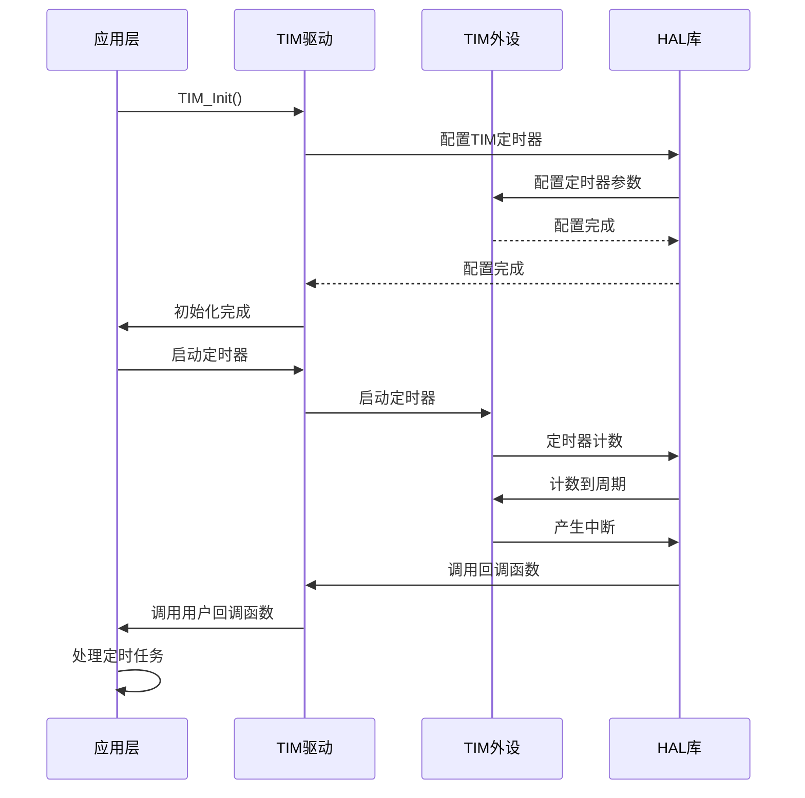

# TIM定时器驱动程序深度解析

## 整体概述

这个TIM定时器驱动程序是为STM32F4系列微控制器设计的，用于管理定时器的初始化和中断回调。它采用面向对象的设计思想，通过结构体管理每个定时器的状态，并利用HAL库的定时器中断功能实现定时任务。程序支持多个定时器（TIM1-TIM14），每个定时器有独立的管理对象。

## 文件结构分析

### 1. `drv_tim.h` 文件

#### 头文件保护

```c
#ifndef DRV_TIM_H
#define DRV_TIM_H
```

- 用于防止头文件被重复包含
- 确保编译时只包含一次该头文件

#### 外部依赖

```c
#include "stm32f4xx_hal.h"
```

- STM32F4 HAL库核心头文件，提供硬件抽象层接口

#### 回调函数类型

```c
typedef void (*TIM_Call_Back)();
```

- 定义定时器中断回调函数类型
- 无参数，无返回值

#### 定时器管理结构体

```c
struct Struct_TIM_Manage_Object{
    TIM_HandleTypeDef *TIM_Handler;
    TIM_Call_Back Callback_Function;
};
```

- **作用**：管理单个定时器的通信状态
- **成员说明**：
  - `TIM_Handler`: 定时器句柄指针
  - `Callback_Function`: 定时器中断回调函数

#### 外部变量声明

```c
extern bool init_finished;
extern TIM_HandleTypeDef htim3;
extern TIM_HandleTypeDef htim4;
extern TIM_HandleTypeDef htim5;
extern TIM_HandleTypeDef htim12;
extern Struct_TIM_Manage_Object TIM1_Manage_Object;
extern Struct_TIM_Manage_Object TIM2_Manage_Object;
// ... 其他TIM管理对象
```

- **作用域**：全局作用域
- **说明**：
  - `init_finished`: 初始化完成标志
  - `htim3`, `htim4`, ...: 定时器句柄
  - `TIMx_Manage_Object`: 14个定时器的管理对象

#### 函数声明

```c
void TIM_Init(TIM_HandleTypeDef *htim, TIM_Call_Back Callback_Function);
```

- **作用**：初始化定时器管理对象

## 2. `drv_tim.cpp` 文件

#### 全局变量初始化

```c
Struct_TIM_Manage_Object TIM1_Manage_Object;
Struct_TIM_Manage_Object TIM2_Manage_Object;
// ... 其他TIM管理对象
```

- **作用**：初始化所有定时器管理对象
- **说明**：所有成员被初始化为0，确保初始状态安全

#### TIM初始化函数

```c
void TIM_Init(TIM_HandleTypeDef *htim, TIM_Call_Back Callback_Function)
{
    if (htim->Instance == TIM1) {
        TIM1_Manage_Object.TIM_Handler = htim;
        TIM1_Manage_Object.Callback_Function = Callback_Function;
    }
    else if (htim->Instance == TIM2) {
        TIM2_Manage_Object.TIM_Handler = htim;
        TIM2_Manage_Object.Callback_Function = Callback_Function;
    }
    // ... 其他定时器的处理
}
```

- **作用**：初始化定时器管理对象
- **参数**：
  - `htim`: 定时器句柄
  - `Callback_Function`: 中断回调函数
- **实现**：
  - 根据定时器实例选择对应的管理对象
  - 设置定时器句柄和回调函数
- **外设资源**：TIM1-TIM14定时器

#### HAL库定时器中断回调函数

```c
void HAL_TIM_PeriodElapsedCallback(TIM_HandleTypeDef *htim)
{
    // 判断程序初始化完成
    if (init_finished == false) {
        return;
    }
    // 选择回调函数
    if (htim->Instance == TIM1) {
        if(TIM1_Manage_Object.Callback_Function != nullptr) {
            TIM1_Manage_Object.Callback_Function();
        }
    }
    else if (htim->Instance == TIM2) {
        if(TIM2_Manage_Object.Callback_Function != nullptr) {
            TIM2_Manage_Object.Callback_Function();
        }
    }
    // ... 其他定时器的处理
}
```

- **作用**：HAL库定时器中断完成后的回调函数
- **实现**：
  1. 检查初始化完成标志
  2. 根据定时器实例选择对应的管理对象
  3. 调用用户提供的回调函数
- **外设资源**：TIM1-TIM14定时器（中断触发）

## 架构设计图



## 通信流程图



## 关键设计特点

1. **面向对象设计**：
   - 通过`Struct_TIM_Manage_Object`结构体封装定时器状态
   - 每个定时器有独立的管理对象
2. **中断回调机制**：
   - 通过`HAL_TIM_PeriodElapsedCallback`实现定时器中断回调
   - 用户只需实现回调函数处理定时任务
3. **多定时器支持**：
   - 支持TIM1-TIM14，每个定时器独立管理
   - 通过实例判断选择对应管理对象
4. **初始化检查**：
   - 在中断回调中检查`init_finished`标志
   - 避免在初始化未完成时调用回调函数
5. **空指针检查**：
   - 在调用回调函数前检查`Callback_Function`是否为空
   - 避免程序崩溃

## 外设资源使用总结

| 外设资源   | 用途         | 使用数量 | 说明                   |
| ---------- | ------------ | -------- | ---------------------- |
| TIM1-TIM14 | 定时器外设   | 14个     | 每个定时器独立管理     |
| 中断       | 定时器中断   | 14个     | 每个定时器使用独立中断 |
| 定时器配置 | 定时周期设置 | 14个     | 每个定时器可独立配置   |

## 使用示例

```c
// 回调函数实现
void Timer_Callback() {
    // 处理定时任务
    // 例如：更新状态、控制输出等
}

// 初始化TIM3
TIM_HandleTypeDef htim3;
TIM_Init(&htim3, Timer_Callback);

// 启动TIM3定时器（需在HAL库中配置）
HAL_TIM_Base_Start_IT(&htim3);
```

## 代码设计亮点

1. **结构化设计**：通过结构体集中管理定时器状态，提高代码可读性和可维护性
2. **资源解耦**：定时器管理与业务逻辑分离，用户只需关注定时任务处理
3. **扩展性**：支持TIM1-TIM14，可轻松扩展到更多定时器
4. **健壮性**：添加了初始化完成标志和回调函数空指针检查，避免程序崩溃
5. **HAL库集成**：充分利用HAL库的中断机制，简化开发流程

## 潜在改进建议

1. **添加定时器配置功能**：在`TIM_Init`中加入定时器配置参数
2. **支持不同模式**：添加定时器模式（向上计数/向下计数）配置
3. **添加超时机制**：防止定时器长时间未触发
4. **优化内存使用**：考虑动态分配管理对象，减少固定数量的限制
5. **添加错误处理**：在定时器配置失败时提供错误处理机制

## 与SPI驱动程序对比

| 特性     | TIM驱动    | SPI驱动          |
| -------- | ---------- | ---------------- |
| 主要用途 | 定时任务   | 串行通信         |
| 外设     | TIM1-TIM14 | SPI1-SPI6        |
| 通信方式 | 中断       | DMA              |
| 回调函数 | 无参数     | 有数据缓冲区参数 |
| 数据传输 | 无数据传输 | 有数据传输       |
| 片选控制 | 无         | 有GPIO控制       |

这个TIM定时器驱动程序设计合理，结构清晰，适合在STM32F4平台上进行定时任务开发，特别适合需要精确时间控制的机器人或嵌入式系统应用。