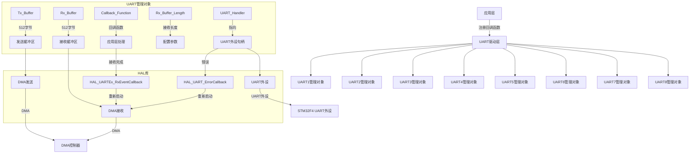

# STM32 UART通信驱动深度解析

## 整体架构介绍

这是一个基于STM32F4系列MCU的UART通信驱动程序，采用HAL库实现。它提供了UART初始化、数据发送、接收处理和错误处理功能，使用DMA实现高效数据传输，并支持回调函数机制。系统支持8个UART通道（USART1-8），每个通道有独立的管理对象。

------

## 头文件 `drv_uart.h` 详细解析

### 1. 文件头信息

```c
/** * @file drv_uart.h * @author yssickjgd (1345578933@qq.com) * @brief 仿照SCUT-Robotlab改写的UART通信初始化与配置流程 * @version 0.1 * @date 2023-08-29 0.1 23赛季定稿 * @date 2023-11-18 1.1 修改成cpp * @date 2024-05-05 1.2 新增错误中断 * * @copyright USTC-RoboWalker (c) 2023-2024 * */
```

- 文件功能：UART通信驱动头文件
- 作者：yssickjgd
- 版本历史：从0.1到1.2的版本迭代
- 版权信息：USTC-RoboWalker (2023-2024)

### 2. 头文件包含

```c
#include "stm32f4xx_hal.h"
#include "usart.h"
#include <string.h>
```

- `stm32f4xx_hal.h`：STM32F4 HAL库核心头文件，提供硬件抽象层接口
- `usart.h`：STM32 UART外设相关头文件
- `string.h`：C标准库字符串处理函数

### 3. 宏定义

```c
#define UART_BUFFER_SIZE 512
```

- 定义UART接收缓冲区大小为512字节
- 用于分配接收和发送缓冲区

### 4. 类型定义

```c
typedef void (*UART_Call_Back)(uint8_t *Buffer, uint16_t Length);
```

- 定义UART接收回调函数类型
- 函数指针类型，参数：接收数据缓冲区指针、数据长度
- 作用：允许用户在数据接收完成后执行自定义处理

### 5. 结构体定义

```c
struct Struct_UART_Manage_Object{
    UART_HandleTypeDef *UART_Handler;
    uint8_t Tx_Buffer[UART_BUFFER_SIZE];
    uint8_t Rx_Buffer[UART_BUFFER_SIZE];
    uint16_t Rx_Buffer_Length;
    UART_Call_Back Callback_Function;
};
```

- **作用**：UART通信管理对象，封装每个UART通道的配置和状态
- **成员说明**：
  - `UART_Handler`：指向UART外设句柄的指针（HAL库结构体）
  - `Tx_Buffer`：发送缓冲区（512字节）
  - `Rx_Buffer`：接收缓冲区（512字节）
  - `Rx_Buffer_Length`：接收缓冲区长度
  - `Callback_Function`：接收完成后的回调函数指针

### 6. 外部变量声明

```c
extern bool init_finished;
extern Struct_UART_Manage_Object UART1_Manage_Object;
extern Struct_UART_Manage_Object UART2_Manage_Object;
... // 其他UART通道
```

- `init_finished`：布尔标志，表示系统初始化是否完成
- `UARTx_Manage_Object`：8个UART通道的管理对象实例
- **作用域**：全局作用域，可在其他文件中访问

### 7. 函数声明

```c
void UART_Init(UART_HandleTypeDef *huart, UART_Call_Back Callback_Function, uint16_t Rx_Buffer_Length);
void UART_Reinit(UART_HandleTypeDef *huart);
uint8_t UART_Send_Data(UART_HandleTypeDef *huart, uint8_t *Data, uint16_t Length);
void TIM_1ms_UART_PeriodElapsedCallback();
```

- **UART_Init**：初始化UART通信
- **UART_Reinit**：重新初始化UART（用于错误恢复）
- **UART_Send_Data**：通过DMA发送数据
- **TIM_1ms_UART_PeriodElapsedCallback**：定时器回调函数（预留）

------

## 源文件 `drv_uart.cpp` 详细解析

### 1. 外部变量定义

```c
Struct_UART_Manage_Object UART1_Manage_Object = {0};
Struct_UART_Manage_Object UART2_Manage_Object = {0};
... // 其他UART通道
```

- 初始化所有UART管理对象，将所有成员初始化为0
- **作用**：确保每个UART通道有独立的配置和状态

### 2. `UART_Init` 函数

```c
void UART_Init(UART_HandleTypeDef *huart, UART_Call_Back Callback_Function, uint16_t Rx_Buffer_Length)
{
    if (huart->Instance == USART1) {
        UART1_Manage_Object.UART_Handler = huart;
        UART1_Manage_Object.Callback_Function = Callback_Function;
        UART1_Manage_Object.Rx_Buffer_Length = Rx_Buffer_Length;
        HAL_UARTEx_ReceiveToIdle_DMA(huart, UART1_Manage_Object.Rx_Buffer, UART1_Manage_Object.Rx_Buffer_Length);
    }
    // 其他UART通道实现类似
}
```

- **作用**：初始化UART通信，设置接收DMA
- **参数**：
  - `huart`：UART外设句柄
  - `Callback_Function`：接收完成回调函数
  - `Rx_Buffer_Length`：接收缓冲区长度
- **关键操作**：
  1. 根据UART实例（USART1-8）选择对应的管理对象
  2. 设置管理对象的成员变量
  3. 调用HAL库函数 `HAL_UARTEx_ReceiveToIdle_DMA` 开始DMA接收
- **外设资源**：使用STM32F4的UART外设和DMA控制器

### 3. `UART_Reinit` 函数

```c
void UART_Reinit(UART_HandleTypeDef *huart)
{
    if (huart->Instance == USART1) {
        HAL_UARTEx_ReceiveToIdle_DMA(huart, UART1_Manage_Object.Rx_Buffer, UART1_Manage_Object.Rx_Buffer_Length);
    }
    // 其他UART通道实现类似
}
```

- **作用**：UART通信中断后重新初始化
- **使用场景**：当UART通信出现错误（如数据丢失、超时）时调用
- **关键操作**：重新启动DMA接收，不改变其他配置

### 4. `UART_Send_Data` 函数

```c
uint8_t UART_Send_Data(UART_HandleTypeDef *huart, uint8_t *Data, uint16_t Length)
{
    return (HAL_UART_Transmit_DMA(huart, Data, Length));
}
```

- **作用**：通过DMA发送数据
- **参数**：
  - `huart`：UART外设句柄
  - `Data`：要发送的数据缓冲区指针
  - `Length`：发送数据长度
- **返回值**：HAL库返回的状态码
- **外设资源**：使用UART外设的DMA发送功能

### 5. `HAL_UARTEx_RxEventCallback` 函数

```c
void HAL_UARTEx_RxEventCallback(UART_HandleTypeDef *huart, uint16_t Size)
{
    if (init_finished == false) {
        return;
    }
    if (huart->Instance == USART1) {
        if(UART1_Manage_Object.Callback_Function != nullptr) {
            UART1_Manage_Object.Callback_Function(UART1_Manage_Object.Rx_Buffer, Size);
        }
        HAL_UARTEx_ReceiveToIdle_DMA(huart, UART1_Manage_Object.Rx_Buffer, UART1_Manage_Object.Rx_Buffer_Length);
    }
    // 其他UART通道实现类似
}
```

- **作用**：UART接收DMA空闲中断回调函数
- **关键流程**：
  1. 检查初始化是否完成
  2. 调用用户注册的回调函数处理接收到的数据
  3. 重新启动DMA接收，准备下一次接收
- **外设资源**：UART外设的DMA接收功能
- **设计亮点**：使用DMA的"接收空闲"事件（Idle Event）实现高效接收

### 6. `HAL_UART_ErrorCallback` 函数

```c
void HAL_UART_ErrorCallback(UART_HandleTypeDef *huart)
{
    if (huart->Instance == USART1) {
        HAL_UARTEx_ReceiveToIdle_DMA(huart, UART1_Manage_Object.Rx_Buffer, UART1_Manage_Object.Rx_Buffer_Length);
    }
    // 其他UART通道实现类似
}
```

- **作用**：UART错误中断处理函数
- **关键操作**：当UART发生错误（如帧错误、溢出）时，重新启动接收
- **设计亮点**：错误处理后自动恢复通信，提高系统鲁棒性

------

## 系统架构图



## 关键设计特点

1. **面向对象设计**：
   - 使用结构体 `Struct_UART_Manage_Object` 封装UART通道的配置和状态
   - 每个UART通道有独立的管理对象，避免相互干扰
2. **DMA高效传输**：
   - 接收使用 `HAL_UARTEx_ReceiveToIdle_DMA`，在空闲时自动接收
   - 发送使用 `HAL_UART_Transmit_DMA`，非阻塞式发送
   - 避免CPU轮询，提高系统效率
3. **错误处理机制**：
   - `HAL_UART_ErrorCallback` 处理UART错误
   - 自动重新启动接收，实现通信自恢复
4. **回调机制**：
   - 用户注册回调函数处理接收到的数据
   - 实现了通信与应用逻辑的解耦
5. **资源管理**：
   - 512字节缓冲区（可调整）平衡内存和性能
   - 每个UART通道独立配置，支持多通道并行通信

------

## 使用示例

### 初始化UART

```c
// 假设已配置好USART1的GPIO和时钟
UART_Init(&huart1, MyDataCallback, 256);
```

### 回调函数实现

```c
void MyDataCallback(uint8_t *Buffer, uint16_t Length)
{
    // 处理接收到的数据
    // 例如：解析数据包、执行控制命令
    ProcessReceivedData(Buffer, Length);
}
```

### 发送数据

```c
uint8_t data[] = "Hello UART";
UART_Send_Data(&huart1, data, sizeof(data));
```

------

## 外设资源使用总结

| 资源类型  | 使用情况               | 说明                         |
| --------- | ---------------------- | ---------------------------- |
| UART外设  | 8通道 (USART1-8)       | 每个UART通道独立管理         |
| DMA控制器 | 2个DMA通道 (发送/接收) | 每个UART通道使用独立DMA通道  |
| 内存      | 8×(512+512) = 8KB      | 每个UART通道2个512字节缓冲区 |
| 中断      | UART接收空闲中断       | 用于触发数据处理             |
| 中断      | UART错误中断           | 用于错误恢复                 |

------

## 设计优势

1. **模块化设计**：每个UART通道独立管理，易于扩展和维护
2. **高效传输**：DMA实现零CPU开销的串行通信
3. **健壮性**：错误处理和自动恢复机制提高系统可靠性
4. **灵活性**：可配置接收缓冲区大小和回调函数
5. **与HAL库良好集成**：充分利用STM32 HAL库功能

这个驱动程序是STM32F4系列UART通信的优秀实现，特别适合机器人控制、嵌入式系统等需要可靠串行通信的场景。